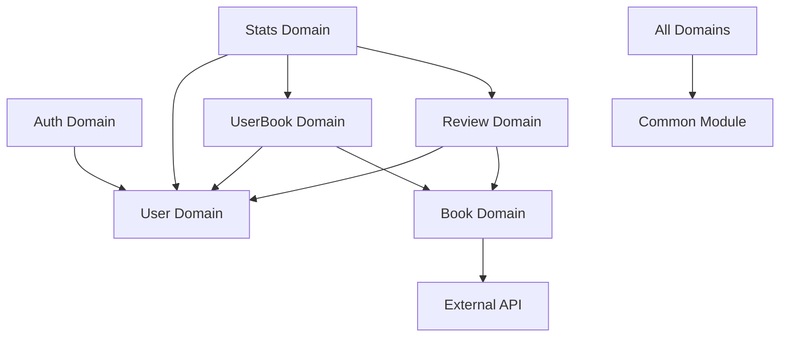

# BookLog 프로젝트 아키텍처

## 📋 개요

BookLog는 **도메인 기반 아키텍처(Domain-Driven Architecture)**를 채택하여 구현된 책 기록 및 리뷰 공유 서비스입니다. 기존의 계층형 구조에서 도메인 중심 구조로 리팩토링하여 **높은 응집성과 낮은 결합도**를 달성했습니다.

## 🏗️ 전체 프로젝트 구조

```
📁 src/main/java/com/example/booklog/
├── 📄 BooklogApplication.java         # Spring Boot 메인 클래스
│
├── 📁 common/                         # 공통 모듈
│   ├── 📁 config/                    # 설정 클래스
│   │   ├── JpaConfig.java            # JPA 설정 (Auditing)
│   │   ├── SecurityConfig.java       # Spring Security 설정
│   │   ├── SwaggerConfig.java        # Swagger/OpenAPI 설정
│   │   └── WebClientConfig.java      # WebClient 설정
│   │
│   ├── 📁 exception/                 # 예외 처리
│   │   ├── CustomException.java      # 커스텀 예외 클래스
│   │   ├── ErrorCode.java            # 에러 코드 정의
│   │   ├── ErrorResponse.java        # 에러 응답 DTO
│   │   └── GlobalExceptionHandler.java # 글로벌 예외 핸들러
│   │
│   ├── 📁 security/                  # 보안 관련
│   │   └── JwtAuthenticationFilter.java # JWT 인증 필터
│   │
│   └── 📁 util/                      # 유틸리티
│       └── JwtUtil.java              # JWT 토큰 유틸리티
│
└── 📁 domain/                         # 도메인별 모듈
    ├── 📁 auth/                      # 🔐 인증 도메인
    │   ├── 📁 controller/
    │   │   └── AuthController.java   # 회원가입, 로그인 API
    │   ├── 📁 dto/
    │   │   ├── AuthResponse.java     # 인증 응답 DTO
    │   │   ├── LoginRequest.java     # 로그인 요청 DTO
    │   │   └── RegisterRequest.java  # 회원가입 요청 DTO
    │   └── 📁 service/
    │       └── AuthService.java      # 인증 비즈니스 로직
    │
    ├── 📁 user/                      # 👤 사용자 도메인
    │   ├── 📁 entity/
    │   │   └── User.java             # 사용자 엔티티
    │   ├── 📁 repository/
    │   │   └── UserRepository.java   # 사용자 리포지토리
    │   └── 📁 service/
    │       ├── CustomUserDetails.java      # Spring Security UserDetails 구현
    │       ├── CustomUserDetailsService.java # UserDetailsService 구현
    │       └── UserService.java       # 사용자 비즈니스 로직
    │
    ├── 📁 book/                      # 📚 책 도메인
    │   ├── 📁 controller/
    │   │   └── BookController.java   # 책 검색 API
    │   ├── 📁 dto/
    │   │   ├── BookSearchResponse.java      # 책 검색 응답 DTO
    │   │   └── GoogleBooksApiResponse.java  # Google Books API 응답 DTO
    │   ├── 📁 entity/
    │   │   └── Book.java             # 책 엔티티
    │   ├── 📁 repository/
    │   │   └── BookRepository.java   # 책 리포지토리
    │   └── 📁 service/
    │       ├── BookService.java      # 책 비즈니스 로직
    │       └── GoogleBooksService.java # Google Books API 서비스
    │
    ├── 📁 userbook/                  # 📖 서재 도메인
    │   ├── 📁 controller/
    │   │   └── UserBookController.java # 서재 관리 API
    │   ├── 📁 dto/
    │   │   ├── UserBookRequest.java         # 서재 추가 요청 DTO
    │   │   ├── UserBookResponse.java        # 서재 응답 DTO
    │   │   └── UserBookUpdateRequest.java   # 서재 수정 요청 DTO
    │   ├── 📁 entity/
    │   │   └── UserBook.java         # 사용자-책 관계 엔티티
    │   ├── 📁 repository/
    │   │   └── UserBookRepository.java # 서재 리포지토리
    │   └── 📁 service/
    │       └── UserBookService.java  # 서재 비즈니스 로직
    │
    ├── 📁 review/                    # ⭐ 리뷰 도메인
    │   ├── 📁 controller/
    │   │   └── ReviewController.java # 리뷰 관리 API
    │   ├── 📁 dto/
    │   │   ├── ReviewRequest.java           # 리뷰 작성 요청 DTO
    │   │   ├── ReviewResponse.java          # 리뷰 응답 DTO
    │   │   └── ReviewUpdateRequest.java     # 리뷰 수정 요청 DTO
    │   ├── 📁 entity/
    │   │   └── Review.java           # 리뷰 엔티티
    │   ├── 📁 repository/
    │   │   └── ReviewRepository.java # 리뷰 리포지토리
    │   └── 📁 service/
    │       └── ReviewService.java    # 리뷰 비즈니스 로직
    │
    └── 📁 stats/                     # 📊 통계 도메인
        ├── 📁 controller/
        │   └── StatsController.java  # 통계 API
        ├── 📁 dto/
        │   └── UserStatsResponse.java # 사용자 통계 응답 DTO
        └── 📁 service/
            └── StatsService.java     # 통계 비즈니스 로직
```

## 🎯 아키텍처 설계 원칙

### 1. 도메인 기반 모듈화 (Domain-Driven Design)
- **도메인별 응집성**: 관련된 기능들을 하나의 패키지로 그룹화
- **명확한 책임 분리**: 각 도메인은 고유한 비즈니스 로직을 담당
- **독립적 개발**: 도메인 간 의존성을 최소화하여 병렬 개발 가능

### 2. 공통 모듈 분리 (Common Module Separation)
- **재사용성**: 여러 도메인에서 공통으로 사용하는 기능을 별도 모듈로 분리
- **일관성**: 공통 설정과 유틸리티를 통한 일관된 동작 보장

### 3. 계층별 구조 (Layered Architecture within Domain)
각 도메인 내부에서 다음과 같은 계층 구조를 유지:
- **Controller**: API 엔드포인트 및 요청/응답 처리
- **Service**: 비즈니스 로직 구현
- **Repository**: 데이터 접근 로직
- **Entity**: 도메인 모델
- **DTO**: 데이터 전송 객체

## 🔄 도메인 간 의존성



### 의존성 규칙
1. **Common 모듈**: 모든 도메인에서 참조 가능
2. **도메인 간 참조**: 필요한 경우에만 다른 도메인의 Service나 Entity 참조
3. **순환 의존성 방지**: 도메인 간 순환 참조를 피하기 위한 설계

## 🚀 아키텍처의 장점

### 1. 유지보수성 향상
- **모듈별 독립성**: 특정 기능 수정 시 해당 도메인만 집중
- **명확한 구조**: 기능별로 코드가 명확하게 분리되어 이해하기 쉬움

### 2. 확장성 개선
- **새 기능 추가**: 새로운 도메인 추가 시 기존 코드에 영향 최소화
- **마이크로서비스 전환**: 필요 시 도메인별로 독립적인 서비스로 분리 가능

### 3. 팀 협업 최적화
- **도메인별 팀 배정**: 각 팀이 담당 도메인에 집중
- **병렬 개발**: 도메인 간 의존성이 낮아 동시 개발 가능

### 4. 테스트 용이성
- **단위 테스트**: 도메인별로 독립적인 테스트 가능
- **통합 테스트**: 도메인 간 상호작용 테스트 명확화

## 📝 주요 패턴 및 기술

### 1. 사용된 디자인 패턴
- **Repository Pattern**: 데이터 접근 로직 추상화
- **Service Layer Pattern**: 비즈니스 로직 캡슐화
- **DTO Pattern**: 계층 간 데이터 전송 최적화
- **Exception Handling Pattern**: 일관된 예외 처리

### 2. 기술 스택
- **Backend**: Spring Boot 3.4.7, Java 17
- **Database**: MySQL 8.0, Spring Data JPA
- **Security**: Spring Security, JWT
- **API Documentation**: Swagger/OpenAPI 3
- **External API**: Google Books API (WebClient)

## 🔄 리팩토링 히스토리

### Before (계층형 구조)
```
src/main/java/com/example/booklog/
├── controller/     # 모든 컨트롤러
├── service/        # 모든 서비스
├── repository/     # 모든 리포지토리
├── entity/         # 모든 엔티티
├── dto/            # 모든 DTO
├── config/         # 설정
├── exception/      # 예외 처리
└── util/           # 유틸리티
```

### After (도메인 기반 구조)
```
src/main/java/com/example/booklog/
├── common/         # 공통 모듈
└── domain/         # 도메인별 모듈
    ├── auth/       # 인증 도메인
    ├── user/       # 사용자 도메인
    ├── book/       # 책 도메인
    ├── userbook/   # 서재 도메인
    ├── review/     # 리뷰 도메인
    └── stats/      # 통계 도메인
```

### 리팩토링 성과
- ✅ **컴파일 성공**: 모든 의존성 문제 해결
- ✅ **기능 정상 동작**: API 엔드포인트 정상 작동
- ✅ **Swagger 문서화**: API 문서 정상 생성
- ✅ **코드 가독성 향상**: 기능별 명확한 구분

---

> 📅 **문서 작성일**: 2025-07-22  
> 📝 **마지막 업데이트**: 도메인 기반 리팩토링 완료  